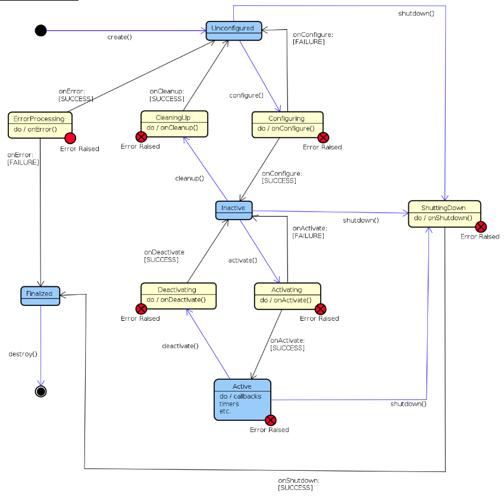

# 如何通过launch文件触发事件

我们准备包lifecycle的节点，即lifecycle_talker_node，此节点已启动，就会进入unconfigured状态，等待事件configure的触发

##  lifecycle_talker_node节点介绍

该节点继承于rclcpp_lifecycle::LifecycleNode，LifecycleNode又继承了LifecycleNodeInterface， 在LifecycleNodeInterface中定义了纯虚函数

```c++
  virtual CallbackReturn 
  on_configure(const State & previous_state);
  
  virtual CallbackReturn 
  on_cleanup(const State & previous_state);

  virtual CallbackReturn
  on_shutdown(const State & previous_state);
  
  virtual CallbackReturn
  on_activate(const State & previous_state);
  
  virtual CallbackReturn
  on_deactivate(const State & previous_state);

  virtual CallbackReturn
  on_error(const State & previous_state);
```

这些函数都是transition callback，一旦发生了状态的改变，就会调用相应的回调函数。


在on_configure中，我们设置了每隔一秒钟发布一次topic。注意，继承于lifecycle的节点，需要设置pub对象为activate才可以发布消息。

在on_activate中，我们设置了 pub_->on_activate()，这样就可以正常发布topic。


因此，我们需要写一个launch文件，发送状态转换的事件，让节点顺利发出topic，并且关闭


# launch事件文件

在此launch文件中，我们启动了lifecycle_talker_node，发出了三个状态改变的事件

- configure_talker：transition_id 为 TRANSITION_CONFIGURE，相当于是下图中蓝色框unconfigured指向黄色框configuring，然后执行configuring，等待结果成功往下进入inactive，失败往上重回unconfigured
- activate_talker：transition_id 为 TRANSITION_ACTIVATE，相当于是下图中蓝色框inactivate指向黄色框Activating，执行Activating，等待结果成功往下进入active，失败往上重回inactive
- shutdown_talker：transition_id 为 TRANSITION_ACTIVE_SHUTDOWN。进入shutdown可以从多个地方进入，我们这里是从active进入的shutdown,

## 生命周期节点参考图



## launch代码

```python
from launch import LaunchDescription
import launch
import launch.events
import launch_ros.event_handlers
import launch_ros.events.lifecycle
import launch_ros.actions

import lifecycle_msgs.msg


def generate_launch_description():

    talker = launch_ros.actions.LifecycleNode(
        name='talker',
        package='learning_ros2_launch_by_example',
        executable='lifecycle_talker_node',
        output='screen')

    configure_talker = launch.actions.EmitEvent(
        event=launch_ros.events.lifecycle.ChangeState(
            lifecycle_node_matcher=launch.events.matches_action(talker),
            transition_id=lifecycle_msgs.msg.Transition.TRANSITION_CONFIGURE
        )
    )
    
    activate_talker = launch.actions.EmitEvent(
        event=launch_ros.events.lifecycle.ChangeState(
            lifecycle_node_matcher=launch.events.matches_action(talker),
            transition_id=lifecycle_msgs.msg.Transition.TRANSITION_ACTIVATE
        )
    )

    shutdown_talker = launch.actions.EmitEvent(
        event=launch_ros.events.lifecycle.ChangeState(
            lifecycle_node_matcher=launch.events.matches_action(talker),
            transition_id=lifecycle_msgs.msg.Transition.TRANSITION_ACTIVE_SHUTDOWN
        )
    )

    ld = LaunchDescription()
    ld.add_entity(configure_talker)
    ld.add_entity(launch.actions.TimerAction(period=5.0, actions=[activate_talker]))
    ld.add_entity(launch.actions.TimerAction(period=10.0, actions=[shutdown_talker]))
    ld.add_entity(talker)  

    return ld
```

# 代码运行

```
ros2 launch learning_ros2_launch_by_example emit_event.launch.py
```

将会看到如下输出

```c++
[lifecycle_talker_node-1] [INFO] [1639638666.150951619] [talker]: on_configure() is called.
[lifecycle_talker_node-1] [INFO] [1639638667.151342532] [talker]: Lifecycle publisher is currently inactive. Messages are not published.
[lifecycle_talker_node-1] [WARN] [1639638667.151475441] [LifecyclePublisher]: Trying to publish message on the topic '/lifecycle_chatter', but the publisher is not activated
[lifecycle_talker_node-1] [INFO] [1639638668.151337521] [talker]: Lifecycle publisher is currently inactive. Messages are not published.
[lifecycle_talker_node-1] [WARN] [1639638668.151470081] [LifecyclePublisher]: Trying to publish message on the topic '/lifecycle_chatter', but the publisher is not activated
[lifecycle_talker_node-1] [INFO] [1639638669.151120273] [talker]: Lifecycle publisher is currently inactive. Messages are not published.
[lifecycle_talker_node-1] [WARN] [1639638669.151219448] [LifecyclePublisher]: Trying to publish message on the topic '/lifecycle_chatter', but the publisher is not activated
[lifecycle_talker_node-1] [INFO] [1639638670.151339756] [talker]: Lifecycle publisher is currently inactive. Messages are not published.
[lifecycle_talker_node-1] [WARN] [1639638670.151470779] [LifecyclePublisher]: Trying to publish message on the topic '/lifecycle_chatter', but the publisher is not activated
[lifecycle_talker_node-1] [INFO] [1639638670.899552819] [talker]: on_activate() is called.
[lifecycle_talker_node-1] [INFO] [1639638672.899960056] [talker]: Lifecycle publisher is active. Publishing: [Lifecycle HelloWorld #5]
[lifecycle_talker_node-1] [INFO] [1639638673.151378913] [talker]: Lifecycle publisher is active. Publishing: [Lifecycle HelloWorld #6]
[lifecycle_talker_node-1] [INFO] [1639638674.151313135] [talker]: Lifecycle publisher is active. Publishing: [Lifecycle HelloWorld #7]
[lifecycle_talker_node-1] [INFO] [1639638675.151190098] [talker]: Lifecycle publisher is active. Publishing: [Lifecycle HelloWorld #8]
[lifecycle_talker_node-1] [INFO] [1639638675.899801928] [talker]: on shutdown is called from state active.
```

最初，我们发送了configure_talker，系统调用了on_configure回调，配置了发布者和定时发布器，由于还没有激活，因此还不可以发送topic数据，5秒之后，launch文件发送了activate_talker，系统激活开始发布数据，5秒之后再发布shutdown_talker
